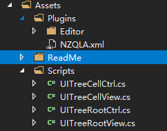
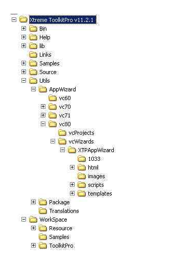

# 树形目录的设计与实现

- 效果图如下  

#### 需求分析
  - 使用场景
    - [X] Game视图中
  - [X] 配置
    - 序列化(有好的配置数据生成机制,只用填写每个节点的最必要数据，比如节点名称、节点数据)
      - 在编辑器中生成配置数据
    - 反序列化
  - 性能优化
    - [X] 既然是Tree，折叠与展开是非常频繁的，新节点的"产生"与旧节点的"删除"，以及该节点下所有节点的位置变化
    -  [X] Tree这种数据结构节点套节点，UI结构如果也是这样，对性能势必造成影响，将其一维化是必然选择 
    - 遍历的效率
      - 这种结构下，通常采用的是递归，在海量节点的情况下，频繁的遍历势必增加CPU负担
        - 遍历机制一样的时候，考虑遍历一次，做多次任务(注意顺序，有些任务需要上次任务全部遍历玩之后才能进行)，避免资源浪费，为此带来的耦合性提升
  - 扩展
    - UI的选择
      - 可以使用各种UI进行，这里提供一个UITree的框架，完善了UItree自身所特有的各种机制，而这些机制与显示的方式选择上原则上不会有影响
    - 使用场景的选择
      - 这里目前是在Game中使用，如果要在检视视图，Window下使用，是否可以打通这些隔阂就看顶层的设计是否进行了足够的抽象
      
